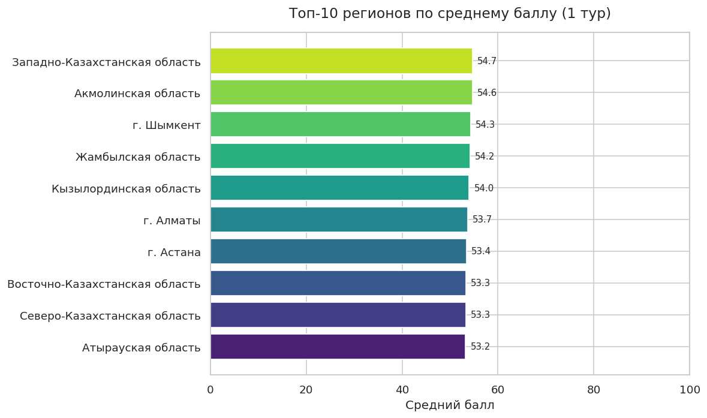
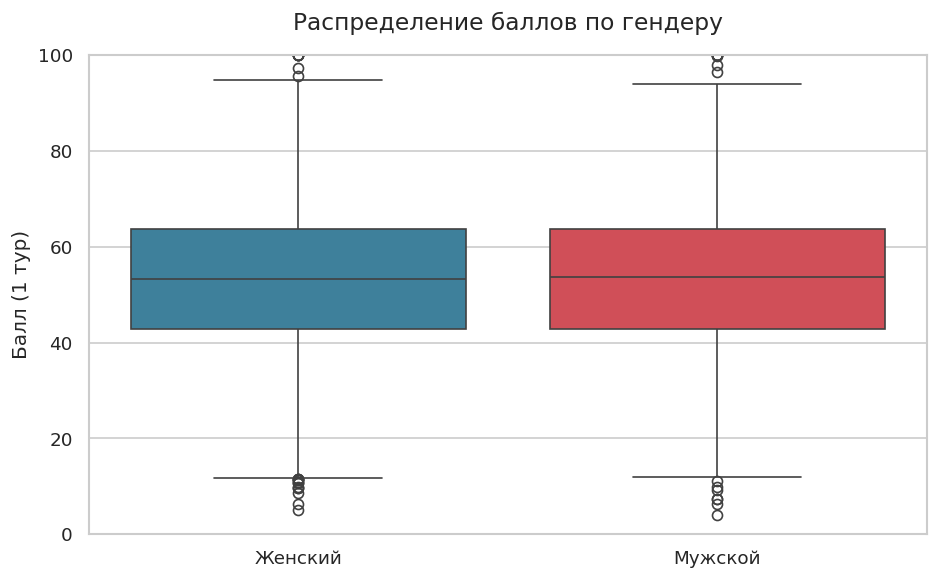

# Olympiad Results Analyzer

> Synthetic data project that analyzes results of a regional school olympiad (8th grade) — by region, gender, language, and family type. Built with Python and pandas.

[](https://www.python.org/)
[](https://pandas.pydata.org/)
[](LICENSE)

---

## What this project does

This project simulates and analyzes results of an 8th-grade school olympiad with **5,000 synthetic participants** from across Kazakhstan. It demonstrates a full data pipeline:

1. **Generate** realistic synthetic data (region, gender, language, family type, scores)
2. **Analyze** results with pandas: group by region, gender, family type, language
3. **Visualize** key insights as publication-ready charts

### Why this project?

I work as a data analyst on real olympiad data for an educational foundation in Kazakhstan. To share my workflow publicly without exposing real participant data, I generated a fully synthetic dataset that mimics the **patterns** I observe in production work — including a well-documented social pattern: students from single-parent families tend to score lower on average.

> ⚠️ **All data is fictional.** Names, regions, and scores are randomly generated. This project is for portfolio and learning purposes only.

---

## Key insights from the analysis

Running the pipeline on 5,000 synthetic participants reveals:

| Metric | Full family | Single-parent family |
|---|---|---|
| Mean score (Round 1) | **54.9** | 49.5 |
| Median score | **55.0** | 49.7 |
| Finalist rate | **23.0%** | 13.2% |

Students from single-parent households score **~5 points lower on average** and are **almost twice less likely** to reach the final round. In real-world analytics, this kind of insight informs targeted support programs.

---

## Sample charts

### 1. Top regions by mean score


### 2. Score distribution by gender


---

## Quick start

### Prerequisites

- Python 3.10 or higher
- pip

### Installation

```bash
# Clone the repository
git clone https://github.com/temirgaukhov/olympiad-results-analyzer.git
cd olympiad-results-analyzer

# (Recommended) Create a virtual environment
python -m venv venv
# Windows:
venv\Scripts\activate
# Linux/Mac:
source venv/bin/activate

# Install dependencies
pip install -r requirements.txt
```

### Run the pipeline

```bash
# Step 1 — generate synthetic data (5,000 participants)
python src/generate_data.py

# Step 2 — run the analysis (prints summary to console + saves CSV report)
python src/analyze.py

# Step 3 — build the charts (saves PNGs to output/charts/)
python src/visualize.py
```

After running all three scripts, check:
- `data/participants.csv` — raw synthetic data
- `output/summary_by_region.csv` — aggregated report
- `output/charts/*.png` — four visualizations

---

## Notebooks — production-style data tasks

The `notebooks/` folder contains three Jupyter notebooks that reproduce common
analyst workflows from real olympiad data processing (all on synthetic data):

| # | Notebook | What it shows |
|---|---|---|
| 01 | [`01_merge_datasets.ipynb`](notebooks/01_merge_datasets.ipynb) | Left join two data sources by `participant_id` — registration + scores |
| 02 | [`02_split_by_region.ipynb`](notebooks/02_split_by_region.ipynb) | Split a master file into per-region files for safe handoff |
| 03 | [`03_count_unique_schools.ipynb`](notebooks/03_count_unique_schools.ipynb) | Count unique entities by hierarchy + clean dirty whitespace (`.str.strip()`) |

These mirror tasks I actually do in production: merging registration data with
test results, generating per-region handoff files, and reconciling unique-counts
when stakeholders ask "how many schools participated?".

GitHub renders executed notebooks inline, so the outputs are visible right in the browser.

---

## Project structure

```
olympiad-results-analyzer/
├── data/
│   └── participants.csv          # synthetic dataset (generated)
├── notebooks/
│   ├── 01_merge_datasets.ipynb
│   ├── 02_split_by_region.ipynb
│   └── 03_count_unique_schools.ipynb
├── src/
│   ├── generate_data.py          # data generation
│   ├── analyze.py                # pandas-based analysis
│   └── visualize.py              # matplotlib/seaborn charts
├── output/
│   ├── summary_by_region.csv     # aggregated report
│   ├── by_region/                # one CSV per region (from notebook 02)
│   └── charts/                   # PNG charts
├── README.md
├── requirements.txt
├── .gitignore
└── LICENSE
```

---

## Tech stack

- **Python 3.10+** — language
- **pandas** — data manipulation and aggregation
- **NumPy** — numerical operations, random data generation
- **matplotlib** — base plotting
- **seaborn** — statistical visualizations and styling

---

## What I learned / demonstrated

- Designing a **reproducible data pipeline** (separate stages for generation / analysis / visualization)
- Working with pandas: `groupby`, `agg`, `merge`, filtering, percentile-based logic, hierarchical counts
- **Real-world data cleaning**: stripping whitespace, dealing with quasi-duplicates
- Building **clear, publication-ready charts** with consistent styling
- Modeling **realistic data distributions** (normal distributions, bias by group)
- Project hygiene: `.gitignore`, `requirements.txt`, MIT license, structured README
- Production-style **notebook workflows** with markdown narration and inline outputs

---

## About the author

**Darkhan Temirgauyk** — Data Analyst at IQanat Educational Foundation, Astana, Kazakhstan.

- 📧 Email: d.temirgauyk@gmail.com
- 🐙 GitHub: [@temirgaukhov](https://github.com/temirgaukhov)
- 🇰🇿 Astana, Kazakhstan

Open to remote opportunities in data analytics, BI, and AI engineering.

---

## License

This project is licensed under the MIT License — see the [LICENSE](LICENSE) file for details.
